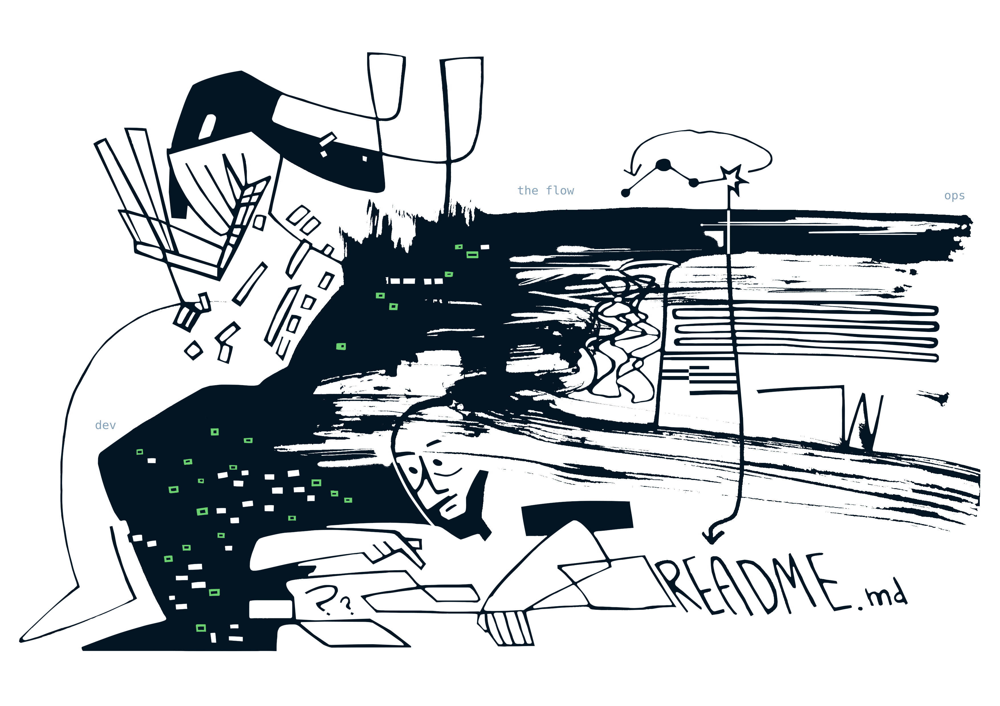
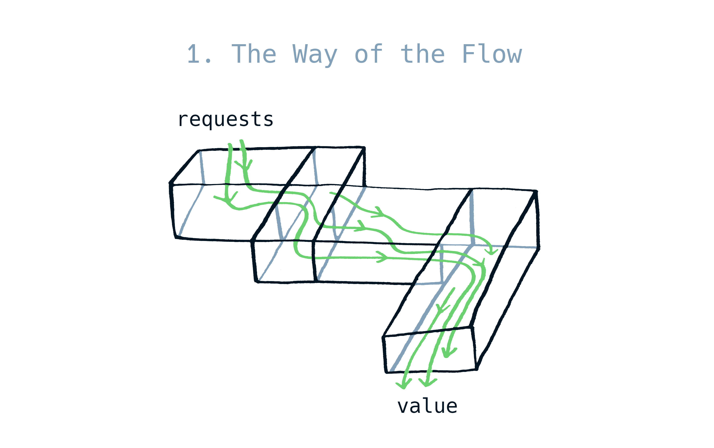
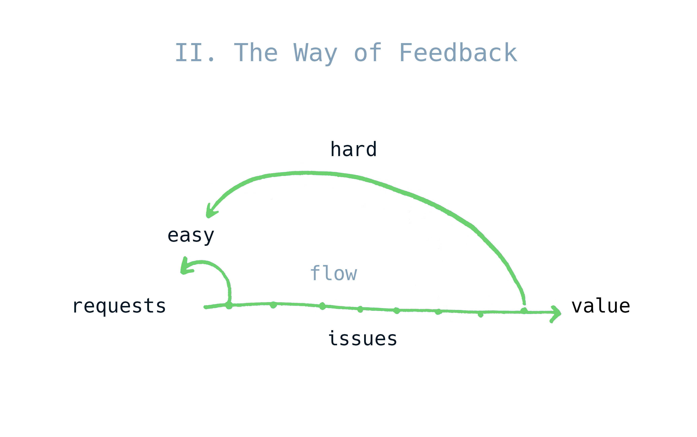
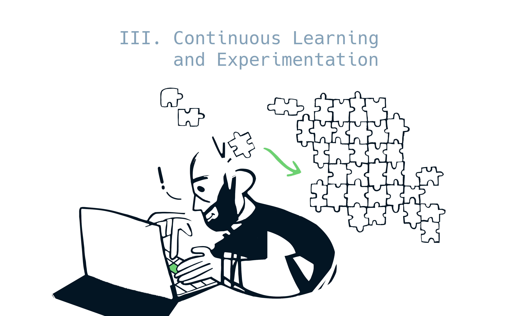
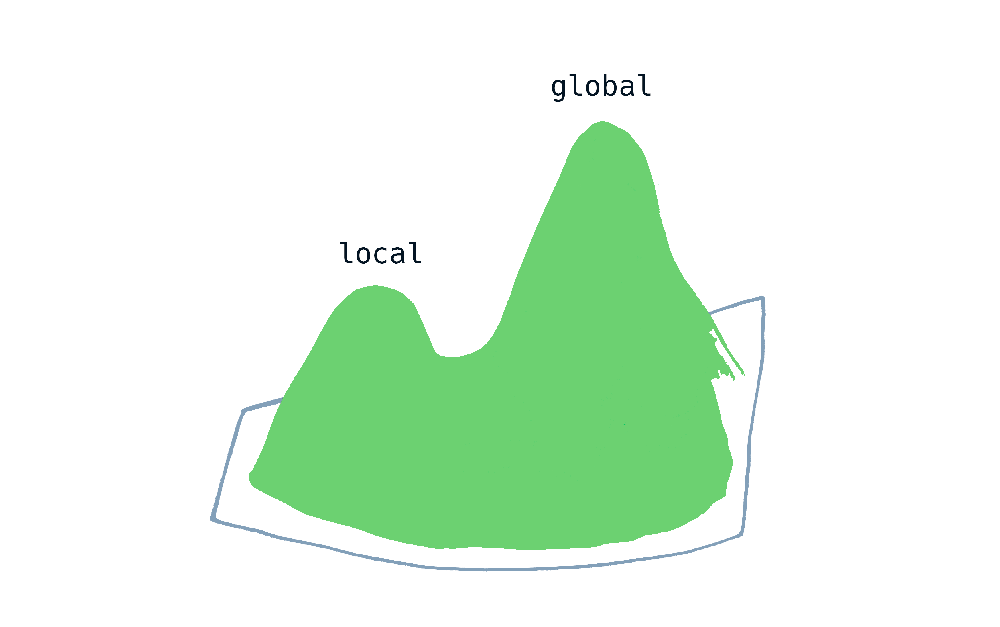

  Artwork by the amazing <a href="https://www.behance.net/elenakolen79ab" target="_blank" rel="noopener">Elena</a>

Let me tell you folks, the software engineering industry is not what it was. Well, not that I really caught the good old days. I'm young enough myself to miss them by a few years. But this is not the industry I imagined in my teens as a frontier of humanity's progress. And of course that's par for the course. The industry has matured, the old guard that built the Goliath is almost gone, replaced with self-replicating corporate structures.

But here lies the danger. Just like the human empire in Isaac Asimov's "Foundation" series, we are at risk of knowledge deterioration. The new generation coming into the industry inherits the tools and processes built by the people who solved the original hard problems. But while the young benefit greatly from those hard learned lessons, the way those lessons were learned and the why's and how's become invisible. Take git for example. I can't even tell you how software engineering was done before it. I guess they made directories like "project_new_v5" maybe? The original problem and what led to this invention is invisible from today's perspective.

In this article I'd like to make a case that DevOps is becoming or in fact has already become one of those phenomena that were so successful we don't value the original thinking that produced the solutions that are now commonplace. And the thinking, not the tools, are its biggest contribution to the industry.

## The naming problem

Let's talk about the naming for a moment. "DevOps" is a terrible name. It's not cool, like "agile", and represents an anachronistic problem. In fact many developers might skip this article because of the title alone.

The people who started the movement set out to solve a specific issue, when "Dev" and "Ops" silos were a particular dysfunction. This is hardly a thing now. Most teams these days share ownership of their systems reliability, and even dedicated SRE teams are not like the old "throw code over the wall" model. Maybe there are surviving mammoths in the wild, but it seems they are few and far between. Could be the COBOL people, but I've never seen one in the wild.

So it seems like few devs take interest in DevOps as a discipline. To most devs I talk to, DevOps is the guy who runs the Kubernetes cluster and builds CI/CD pipelines. But behind the name there's foundational knowledge about what software engineering actually is, as a discipline. If I was ever on the committee of naming things properly forever for everyone, I'd probably call it "The Flow Principles" and add it to university curriculum. Anyway, let's briefly recap "The Three Ways of DevOps" as they are unfortunately named, and then I will rave for a while why it's important for devs to know them.

## The recap

There are only three principles and each is almost obvious and easy to understand. I'll call them "Ways" to pay respect to the original authors.

### I. The Way of the Flow

Imagine your software team as a black box. On the left from the box you have your customers requests and wants, on the right you have the Value the product brings. The Flow is everything that happens in the box and transforms the requests into Value. If you have a software project, the Flow exists whether you think about it or not. 

The Flow is an all-encompassing concept. Hundreds of expected and unexpected factors affect The Flow. Obviously, software architecture plays a big role. Good architecture makes it easy to add features and adapt, so it improves The Flow of Value. Poor architecture slows you down and may need rewrites to unblock The Flow.

Non-code factors are also part of The Flow. If you have a ticket tracker, the way the tickets are created, groomed and closed affects The Flow. The communication habits within your team, due to Conway's Law, affect The Flow. Even the way your team is seated in the office affects The Flow.

A key focus is that this is The Flow of Value, not code. It's an important distinction - we're not shipping code to end users, we're generating Value for them. Value is them using our products to fulfill their needs, actual user outcomes.

The Way of the Flow demands systems thinking. We need to learn to think about not only our immediate code, features or tasks, but how our actions transform The Flow overall. Are we improving or inhibiting it? Are we creating bottlenecks and fragmentation?

### II. The Way of Feedback

As user needs pass through The Flow to become Value, you are inevitably going to run into issues. Feedback is all the ways you discover problems during The Flow to guarantee that the Value delivery is not impeded. This includes many mechanisms: all sorts of testing, release techniques like canary releases or blue/green deployments, observability. Humans provide feedback too, of course. A ticket with a discovered bug from a user is also a mechanism of feedback.

The core insight here is that the problems are easiest to fix the closer they happen to the source. A failed unit test is usually trivial to fix because it provides complete context into where the problem happened. A bug raised in production provides the least immediate information about the specific cause of the problem. The overarching goal here is to make the Feedback loops as short as possible. The shorter the loop - the easier it is to fix the problem.

### III. Continuous Learning and Experimentation

During the process of transforming requests into Value, the people involved are diving deep into the problems and sub-problems assigned to them. While doing this work they form new knowledge about the system itself, its environment and user needs. The issue here is that the knowledge is local to the brains of the person solving the problem. Continuous learning emphasizes that in order to be at our most effective, it's crucial to transform the local knowledge into global, accessible to the larger team. "Continuous" is the key here. When your knowledge sharing is not systemized and is not built into the daily work, you are bound to be regularly losing information and knowledge. The mechanisms here are numerous, but the main one is of course documentation. Devs frequently skip out on documentation and/or just info-dump into a README.md. This guarantees an outcome where knowledge concentrates and does not spread out through the team. Or creates "tribal knowledge" which is too extremely lossy. The Third Way demands this is systemized and approached with the same diligence as the rest of the daily work.

And why the Experimentation? Well, the truth is that optimizing The Flow is a never ending battle. As soon as one constraint is identified and fixed, another one emerges and demands attention. So to be on top of our game we need to explore new ways of work and experiment, always on the lookout for new improvements of our process and product. Without continuous, systemized experimentation we're bound to get stuck and stagnate.

## Principles - shrinciples

Well okay, the principles exist. The Flow forms over your project existing somewhere in the ethereal plane. So what? Why is this so important? Isn't this something that concerns project managers?

Well, I would argue that the Three Ways are The Way to think about software engineering. The three simple principles have immense power that I'm going to illustrate.

### The Predictive Powers or how to become an Oracle

Turns out these principles have remarkable predictive power. Every time they are thoughtlessly violated, the teams pay a high price.

Consider this scenario. You've inherited a legacy service, the architecture is the classic big ball of mud, it's difficult to fix issues or develop new features or even keep the service running. You declare that the project demands a rewrite or it's not going to survive. Now you start on your new shiny v2 that will not repeat the mistakes of the past and will be beautiful and finally functional. Great!

But not only it's one of the "things you should never do" as that one other blog describes it, the Flow principle points us at the exact reasons why. Done carelessly, you are fragmenting the Flow of Value and splitting it into two different directions. You run into a risk of creating two (or maybe more?) separate Flow streams. Optimizing just one is a work of art and meticulous care and analysis but having more creates an impossible task for you. This is guaranteed to be costly for you and the team in terms of resources, time and clarity of the overall process.

Of course, there are ways to mitigate it. When you are faced with this problem and you have The Flow principle in your arsenal, you can design ways for the systems to intertwine in such ways The Flow is preserved. It's a non-trivial task of course, but the difference between going carelessly and keeping The Flow in mind is profound. A few ways how this could be mitigated is using the strangler fig pattern, or building behind feature flags to gradually take over traffic. But the specifics vary from project to project and require understanding The Flow of the particular project.

The place where the Feedback principle violations I've seen happen a lot is asynchronous processing. Say the need for asynchronous task queues comes up. A developer happily reaches for SQS and gets to work. It's called Simple not for nothing, right? After a satisfyingly short dev time the system is set up. The dev checks the logs in production, everything looks fine.

Well, what they might not know is that just by setting up this simple task queue they've stepped into the territory of distributed systems with a whole new class of problems opening up for the project. Months pass, the original dev might not even be on the team anymore. The system might be changed up a bit, growing with new features and patterns. And then the disaster strikes. The system starts behaving weirdly. Sometimes data gets processed late, sometimes never processed at all. Nobody understands what's happening. The devs reach for the logs, but it turns out it's extremely hard to trace what exactly happens in the queue at which specific times. This is entering a rewrite territory. Again, this is costly, time consuming, takes up a lot resources because you now have to somehow keep the old system from breaking down completely while also building a new one. There's danger that a team that doesn't understand the Feedback principle might end up just rebuilding a fragile system again.

Armed with the Feedback principle as a non-negotiable part of the work the devs don't even need to know all the theoretical underpinnings of distributed systems. They will just know that Feedback is crucial, that systems running in production without clarity of its state at any given moment are a design failure. They will build Feedback into the system by default and save time, money and frustration for themselves, their users and the business.

With regards to the Culture of Learning and Experimentation I don't think I even need elaborate illustrations to show the dysfunction because all of us have seen its violations in daily life. Seniors having godlike powers just from being on the project for years. Onboarding for new people taking up months because the systems are incomprehensible from bird's eye view. There's tribal knowledge of corner cases and workarounds that might not even hold true for years.

A lot of us accept this as just part of the job. But that's not normal. Systems should be comprehensible and should not require months to understand. Devs usually don't value that part of the work, treating knowledge sharing as an afterthought. But knowledge sharing is non-negotiable. When systemized and treated as essential work it becomes a power multiplier for the whole team. Systems become crystal clear, onboarding becomes easy and nobody has to do code archeology for hours to fix simple bugs and add features.

## The Local and Global Maxima

When the Three Ways become the truth, one gains X-Ray vision into the daily process of work. One of the insights that emerges is how decisions tend to be made and argued about. A lot of mistakes are made the same way, from optimizing towards local parameters. For example the local parameters could be the speed of development of a specific system or feature, or usage of known tools instead of the right ones. This pushes the system at this specific point towards a local maximum. It fulfills the immediate needs and goals and everyone seems to be happy, both the devs and stakeholders.

But the local maximum is not the place you want to be in. Firstly, you're playing to lose. When building software you set out to win in the market, to keep your users happy and content with your product. Preferably giving them actual feeling of joy when using your product by fulfilling their needs quickly. Secondly, you're making change uncomfortable. Why bother with changes when what we have right now seems to be fine?

Another counter intuitive idea is that optimising locally tends to slow you down globally. If you are not concerned about the global state of the systems, you are not building a fast, unimpeded Flow that will be your system at its best. Decisions made against optimal Flow tend to slow you down and require rewrites down the road. Sometimes the investment to fix them is so massive you're stuck with them forever.

Decisions that move the needle towards the global maximum have a completely different, exponentially positive dynamic. They tend to stack up against each other and create positive influence globally, sometimes even in parts of the system that don't have direct connection to the original problem. The successes tend to snowball and eventually lead you to winning, instead of fighting fires and struggling.

The Three Ways are a compass that points you towards the global maximum. It's what gives you an ability to identify bottlenecks and unobvious issues. Fixing the biggest bottlenecks tends to start a snowball of success rolling. And it teaches to be on the lookout for the next bottleneck, to continuously improve your project and to push towards the best version that the project can be.

## Conclusions

Nothing that I laid out here is new. A lot of experienced devs know this intuitively. However, there's enormous value in giving this wisdom specific, agreed upon, codified language. This makes the intuition learnable and transferable. There's no reason every single dev on Earth has to run into the same problems again and again gaining decades of scars.

I believe that internalizing these principles and learning to think systemically about our work is the path to mastery of our craft. I encourage every dev to dive deeply into DevOps, even if they never touch their Kubernetes clusters themselves.